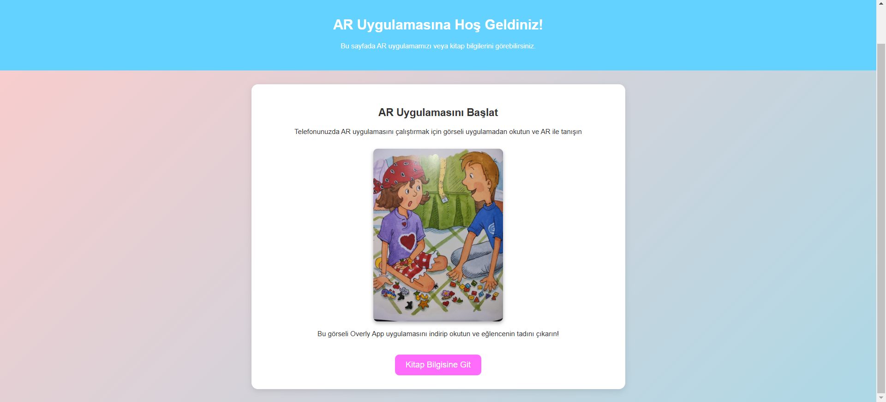
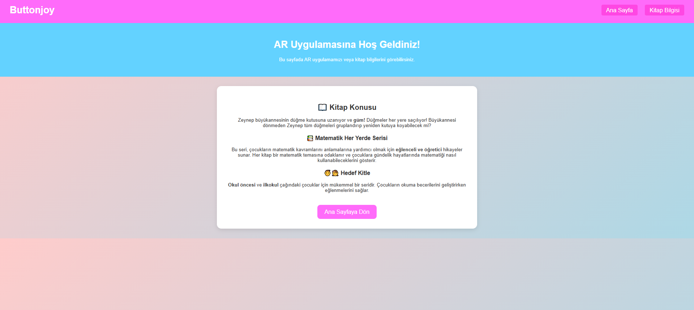

# ButtonJoy Projesi - README

ButtonJoy projesi, çocuklar için eğlenceli ve eğitici artırılmış gerçeklik (AR) deneyimi sunar. Uçak içi eğlence sistemleri için tasarlanmıştır.

---

## Proje Özellikleri
- Mobil uyumlu ve kullanıcı dostu arayüz.
- Artırılmış gerçeklik (AR) entegrasyonu.
- Sayfa yönlendirmeleri ve bağlantılar (Trello, GitHub, Dökümanlar).
- HTML, CSS, JavaScript ile modern bir tasarım.

---

## Kullanılan Teknolojiler
- *HTML5*: Web sayfası yapısı.
- *CSS3*: Stil ve tasarım.
- *JavaScript*: Dinamik özellikler.
- *OverlyApp*: AR entegrasyonu.

---

--- 
## Dokümanlar
[ButtonJoy Dökümanlar (Google Drive)](https://drive.google.com/drive/folders/1IK2gKNPAqg6GHt7ofECA5k5mA6CzkYY1)
--- 

## Proje Yönetimi
[ButtonJoy Proje Yönetimi (Trello)](https://trello.com/b/03Ww7hYq/buttonjoy)
## Web Sitem

## İletişim
Sorularınız veya geri bildirimleriniz için lütfen [meryemzeyaltun@.com](mailto:meryemzeyaltun@gmail.com) adresinden benimle iletişime geçin.
